# Welcome 👋

<a href="https://learn.microsoft.com/api/credentials/share/en-gb/ChristopherRoyall-5637/F722D868FA9BA4ED?sharingId=9998F707F4431F17" target="_blank">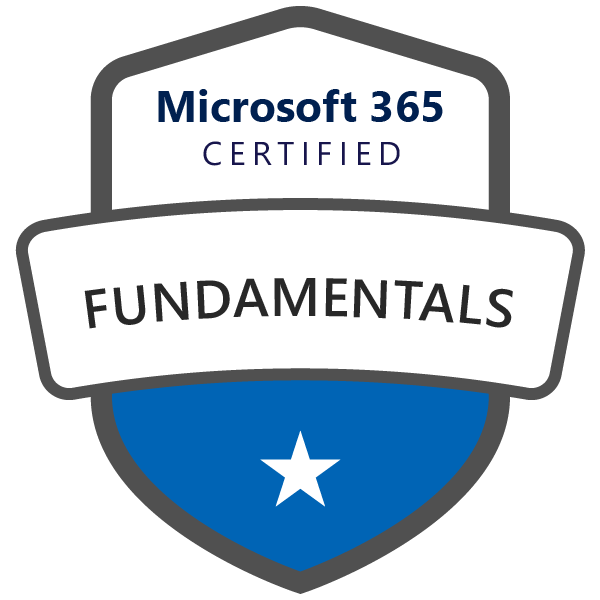</a>
<a href="https://learn.microsoft.com/api/credentials/share/en-gb/ChristopherRoyall-5637/9D221D3A52C63080?sharingId=9998F707F4431F17" target="_blank">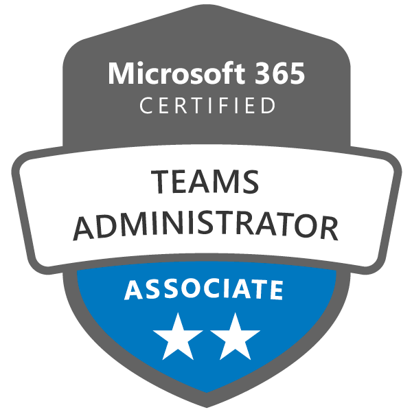</a>
<a href="https://learn.microsoft.com/api/credentials/share/en-gb/ChristopherRoyall-5637/89269917581C4823?sharingId=9998F707F4431F17" target="_blank">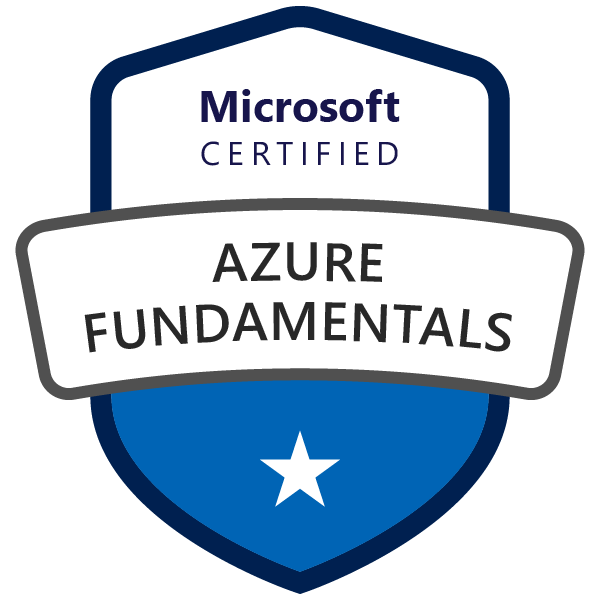</a>

## Projects
Please see a portfolio of my Projects!

### Portfolio
Angular (HTML, CSS, TypeScript), GitHub, AWS (Amplify, Route 53, API Gateway, Lambda, Simple Email Service) 
<a href="https://github.com/chris-royall/portfolio">GitHub Repository</a> 

## 
<a href="https://www.credly.com/badges/a41964c2-fa5e-4a70-9679-f54e1716f80d/public_url" target="_blank">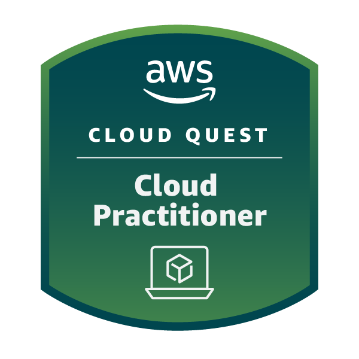</a>
<a href="https://www.credly.com/badges/17653143-16b3-4e17-bce6-593bc0c3e888/public_url" target="_blank">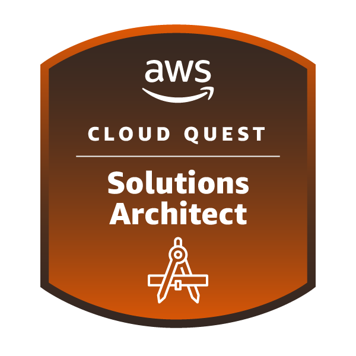</a>
<a href="https://www.credly.com/badges/bf7123f8-d6fa-4668-a586-297a335a77ee/public_url" target="_blank">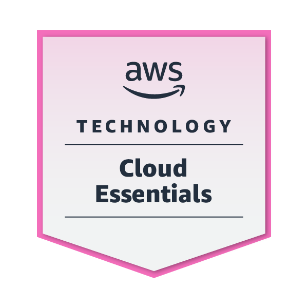</a>
<a href="https://www.credly.com/badges/b489d308-1721-420c-80e9-4451fa8c2df0/public_url" target="_blank">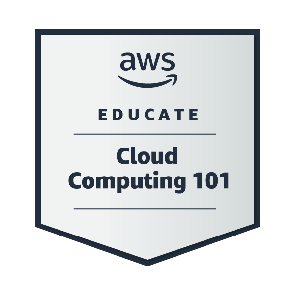</a>
<a href="https://www.credly.com/badges/99b1f1c8-2759-4567-bca9-ab45c8c692e2/public_url" target="_blank">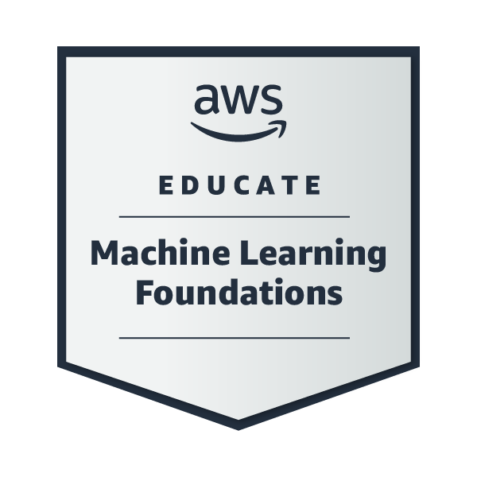</a>
<a href="https://www.credly.com/badges/1276498e-1473-4578-b828-34a13ccdb88e/public_url" target="_blank">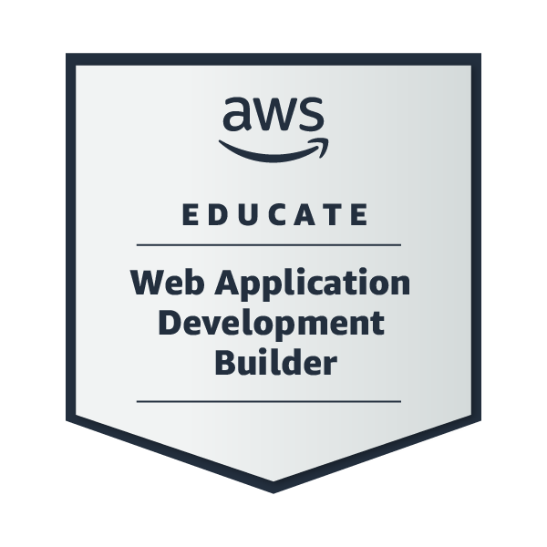</a>
<a href="https://www.credly.com/badges/0aff6a15-5e2a-439d-a346-b6539380e656/public_url" target="_blank">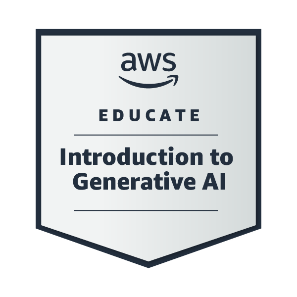</a>
<a href="https://www.credly.com/badges/6fddf01b-631e-4ebe-92e9-b940094ded6c/public_url" target="_blank">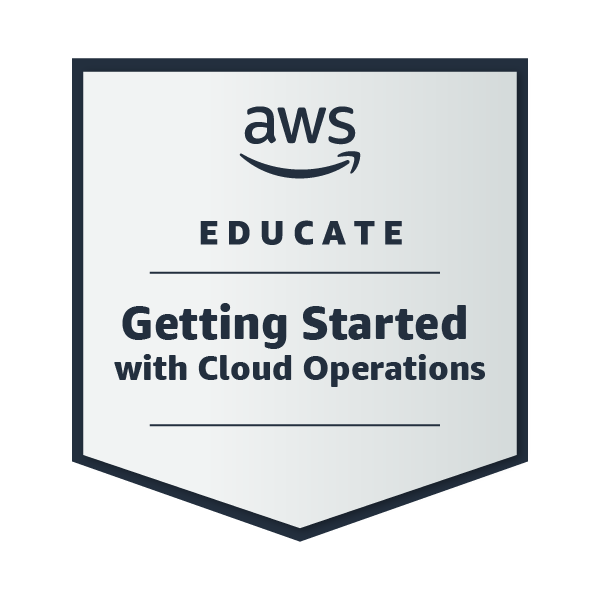</a>
<a href="https://www.credly.com/badges/4c6fe732-2605-481f-b2a2-270a72cdddad/public_url" target="_blank">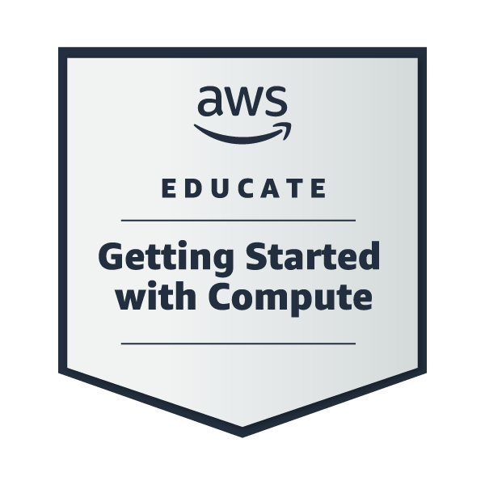</a>
<a href="https://www.credly.com/badges/7ca8e1e6-5471-404c-930a-f1fada61469f/public_url" target="_blank">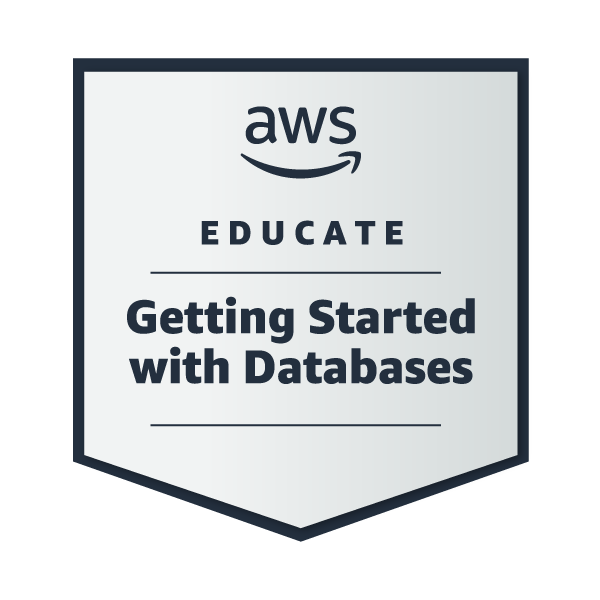</a>
<a href="https://www.credly.com/badges/f29cbe64-5213-446a-9bbb-9e0c4184f84b/public_url" target="_blank">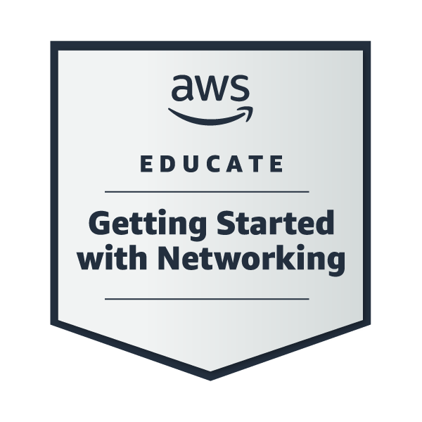</a>
<a href="https://www.credly.com/badges/6795cd0e-d12c-482d-9eca-b74c0410d038/public_url" target="_blank">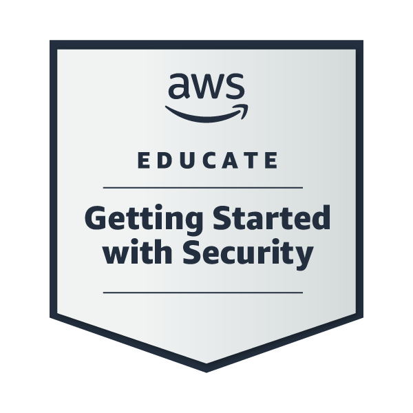</a>
<a href="https://www.credly.com/badges/1779a440-3a8f-406c-afac-c0d682034110/public_url" target="_blank">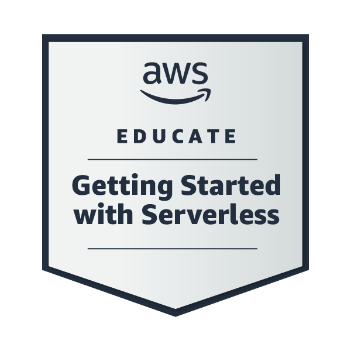</a>
<a href="https://www.credly.com/badges/0f57a79a-f2e8-46dd-b4a9-0da4d2dd479b/public_url" target="_blank">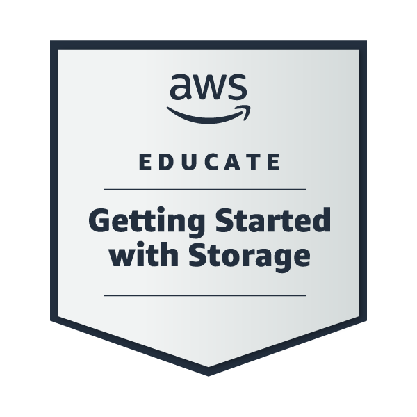</a>
